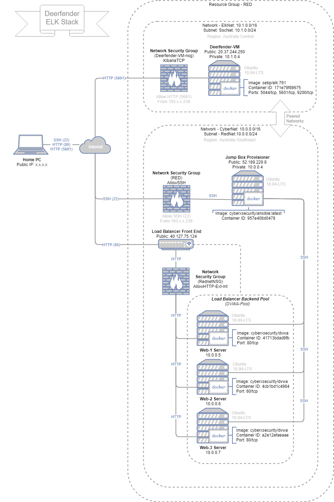
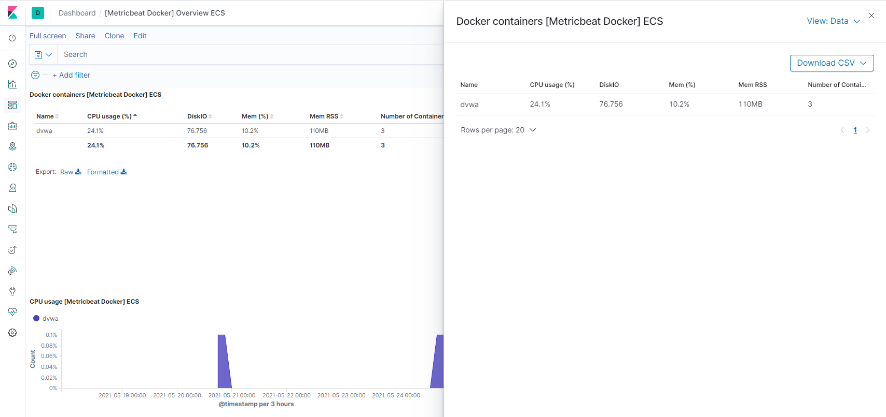

  # DEERFENDERS - Project ELK


<br/><br/><br/>

## Automated ELK Stack Deployment

<br/>The files in this repository were used to configure the network depicted below.

<br/><br/>



These files have been tested and used to generate a live ELK deployment on Azure. They can be used to either recreate the entire deployment pictured above. Alternatively, additional components such as metricbeat and filebeat could be added to this playbook. For this project we used specific isolated playbooks for these modules. See the YAML project repository folder for all playbook files.

  ```
- name: Configure Elk VM with Docker
  hosts: elk
  become: true
  tasks:
    # Use apt module
    - name: Install docker.io
      apt:
        update_cache: yes
        force_apt_get: yes
        name: docker.io
        state: present

      # Use apt module
    - name: Install python3-pip
      apt:
        force_apt_get: yes
        name: python3-pip
        state: present

      # Use pip module (It will default to pip3)
    - name: Install Docker module
      pip:
        name: docker
        state: present

      # Use command module
    - name: Increase virtual memory
      command: sysctl -w vm.max_map_count=262144

      # Use sysctl module
    - name: Use more memory
      sysctl:
        name: vm.max_map_count
        value: 262144
        state: present
        reload: yes

      # Use docker_container module
    - name: download and launch a docker elk container
      docker_container:
        name: elk
        image: sebp/elk:761
        state: started
        restart_policy: always
        # Ports that ELK runs on
        published_ports:
          - 5601:5601
          - 9200:9200
          - 5044:5044

      # Use systemd module
    - name: Enable service docker on boot
      systemd:
        name: docker
        enabled: yes
  ```
<br/>
This document contains the following details:
- Description of the Topology
- Access Policies
- ELK Configuration
  - Beats in Use
  - Machines Being Monitored
- How to Use the Ansible Build
- Some extra scripts to help you out!

<br /><br />

### Contributers 

While the Azure Virtual lab environemnt, IP addresses, files, and screenshots referred to in this document are partially specific, all members of the Deefender project team contributed to this readme file and as such some values may differ. Please raise an issue if you find any inconsistencies.

<br/><br/>

### Description of the Topology

The main purpose of this network is to expose a load-balanced and monitored instance of DVWA, the D*mn Vulnerable Web Application.

Load balancing ensures that the application will be highly available, in addition to restricting direct access to the network.
- A load balancer is a device (physical or virtual) that efficiently distributes network traffic based on configured logic to a pool of backend servers, also known as a server farm or server pool. Load balancers provide multiple advantages; including, availability, scalability, redundancy, and efficiency. Direct access to servers within the pool is not required nor available which reduces the attack surface of the web service.
- The Jump Box acts as a dual purpose control node and is the gateway to the Azure virtual network. A docker ansible image was implemented to provision and accesss the web servers in the hosts group. Advantages of this include having one point of external access and the ability to automate the provisioning of new servers / update of existing servers. By using an ansible docker container, this element is more portable where an Adminisntrator could move the docker container to other machines, another region or jump point and then reprovision as neccessary. 

Integrating an ELK server allows users to easily monitor the vulnerable VMs for changes to the resources and system logs.
- Filebeat monitors log files or specified locations. Once the data is collected it is then forwarded to Elasticsearch for visualisation via Kibana thereafter.
- Metricbeat collects statistics and metric data from the respective operating systems periodically before it's sent to Elasticsearch to be viewed via Kibana.

The configuration details of each machine may be found below.

| Name         | Function   | IP Address | Operating System     |
|--------------|------------|------------|----------------------|
| Jump Box     | Gateway    | 10.0.0.4   | Linux (Ubuntu 18.04) |
| Web Server 1 | Web Server | 10.0.0.5   | Linux (Ubuntu 18.04) |
| Web Server 2 | Web Server | 10.0.0.6   | Linux (Ubuntu 18.04) |
| Web Server 3 | Web Server | 10.0.0.7   | Linux (Ubuntu 18.04) |
| Deerfender   | Elk Stack  | 10.1.0.4   | Linux (Ubuntu 18.04) |

<br />

### Access Policies
__All public IP references have been redacted to ensure privacy of the developers__
<br />

The machines on the internal network are not exposed to the public Internet. Both the DeerFender-VM-NSG and RED Network Security Groups are configured in Azure to deny external access to the internal machines. The devices with external access is outlined below. 

The Jump Box can accept SSH connections from the Internet (Port 22). Access to this machine is only allowed from the following IP addresses:
- Use your public IP from [here](https://www.whatismyip.com/)

The Load balancer can accept HTTP (tcp:80) connections from the Internet. Access to this machine is only allowed from the following IP addresses:
- Use your public IP from [here](https://www.whatismyip.com/)

Machines within the network can only be accessed via SSH from the Ansible container hosted on the Jump Box machine (10.0.0.4).
- The ELK machine is only accessible from the ansible container on the Jump Box via SSH using the the public/private keys created during initial setup.

A summary of the access policies in place can be found in the table below.

| Name         | Publicly Available     | IP Address                        |
|--------------|------------------------|-----------------------------------|
| Jump Box     | Yes (SSH ONLY - 22)    | 10.0.0.4                          |
| Web Server 1 | No                     | 40.127.75.124 - via Load Balancer |
| Web Server 2 | No                     | 40.127.75.124 - via Load Balancer |
| Web Server 3 | No                     | 40.127.75.124 - via Load Balancer |
| Deerfender   | Yes (HTTP ONLY - 5601) | 20.37.244.250                     |

<br />

### Elk Configuration

Ansible was used to automate configuration of the ELK machine. No configuration was performed manually, which is advantageous because of the following:
- Skill Level: Little to zero coding skills required
- Consistency: The ability to remotely configure and setup multiple instances with the exact same environment at ease by just specifying the host group.
- Flexibility: Same configurations are possible on any environment no matter where it is being deployed.
- Simple to Learn: Easy to use for beginners and professionals, being in YAML it also super easy to read and understand.
- Dependancies: No agents are required to be setup as dependancies on the remote machines
- Timeliness: Quick implementation of services and applications.

The playbook implements the following tasks:
- Install Docker and Python3 using the apt module
- Increase ELK Server's virtual memory via Systemctl
- After running Docker via pip, install the ELK image using Docker Container. __(Remember to publish relevant ports!)__
- Enabling Docker Service on boot to ensure availability.

The following screenshot displays the result of running `docker ps` after successfully configuring the ELK instance.


<br />

### Target Machines & Beats
This ELK server is configured to monitor the following machines:
- 10.0.0.5 - Web Server 1
- 10.0.0.6 - Web Server 2
- 10.0.0.7 - Web Server 3

We have installed the following Beats on these machines:
- Filebeat
  - Data Collected: Log data including SSH logins, sudo commands run, and all other log data from the specified locations
  - Example: Sudo Commands

  
  
- Metricbeat
  - Data Collected: System statistics such as CPU Usage, Memory, Network Activity, Disk IO, and Docker Containers per Host
  - Example: CPU/Memory Usage



<br /><br />

### Using the Playbook
In order to use the playbook, you will need to have an Ansible control node already configured. Assuming you have such a control node provisioned: 

SSH into the control node and follow the steps below:
- Copy the YAML files to your /etc/ansible/roles folder. <a href="YAML/">(example)</a>
- Update the /etc/ansible/hosts file to include hosts groups and internal IP addresses for each group <a href="Images/hosts.png">(example)</a>
- Please ensure the interpreter is set to ```ansible_python_interpreter=/usr/bin/python3```
- Run the playbook, and navigate to [ELK SERVER IP:5601] to check that the installation worked as expected.

<br />

### _Secret Scripts_
- Navigate to a folder where you can store your sample scripts and YAML files, use ```cd <chosen directory>```
- Download the tar zip file with all the required files to be run on your Jump Box <a href="">here</a>, using ```curl -L -O https://github.com/ElphaX/Deerfender/deerfender.tar.gz > deerfender.tar.gz```
- Extract the compressed file using the following command: ```tar -zxvf deerfender.tar.gz```
- Enjoy! You've got the files required to have this environment up and running <br />
